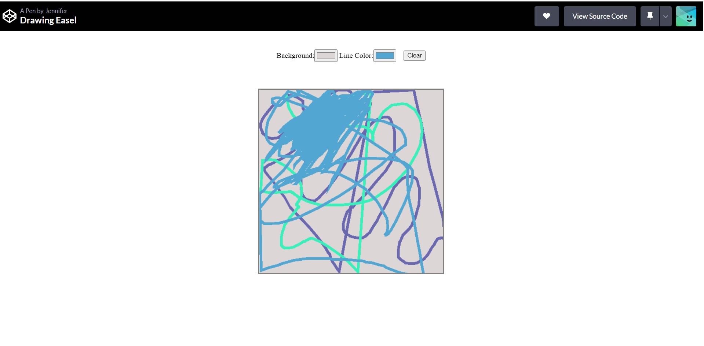

<h1>Painting App</h1>

This is a blank canvas, where the user can draw/paint in different colors. By clicking on the background color-picker, the user can change the background color of the canvas. By clicking on the line color color-picker, the user can change the color of the paint. This app is designed so that the user has their pick of colors-every color under the sun-for both painting and the canvas background. When the user wants to clear the canvas, they simply click the clear button.

This app was created with HTML, CSS and JavaScript.

Go here to use the app: <a href="https://codepen.io/velvetstar/full/WNELxLB" target="_blank">Painting App</a>

<h6>Created by: <a href="mailto:jenniferlaos@pm.me">Jennifer Laos</a></h6>
